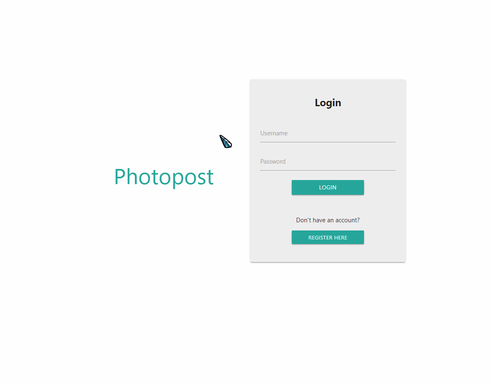
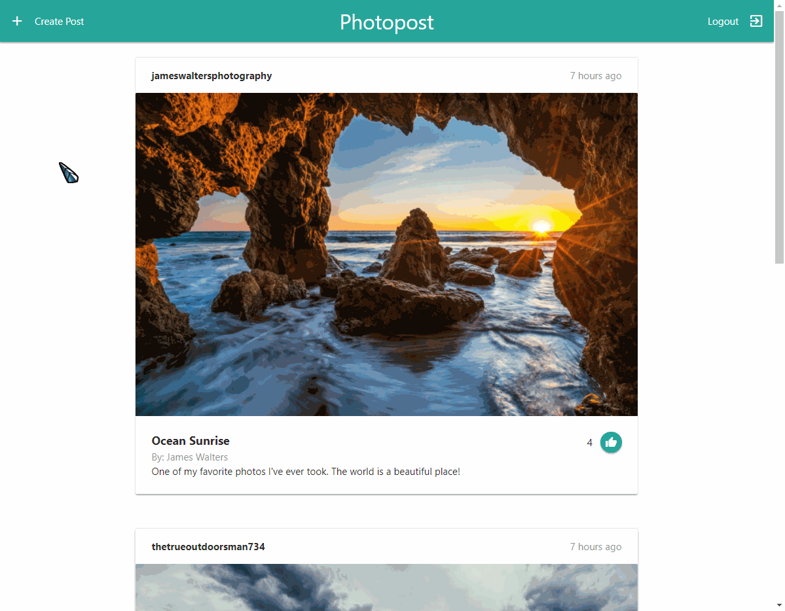

# Photopost

## Summary
Photopost is a social media web application based on the MERN stack that allows users to:
- Register and login
- Share photos by creating posts
- View and like posts created by other users
- Edit and delete existing posts

## Demo
Here are some demo gifs to show off some of the app's features.

### Navigation Overview

### Login/Register
The app features a login and registration page. Passwords are hashed with bcrypt and stored securely. Also, the registration page has some simple server-side validation to ensure that all usernames are unique and that both passwords match.

### Post Layout
Each post tile shows the username of the user who posted it, how long ago it was posted, the photo, the post's title, the creator of the photo, and the post's description. Also, each post has a like button that allows users to like each other's posts and view how many likes each post has.

### Creating a Post
Images are converted into base64 encoded strings and stored directly in the database.

### Editing and Deleting
All posts that were posted by the currently logged in user also have an edit button and a delete button.

### Mobile Friendly Layout
UI is designed to be clean and usable on both desktop devices and devices with narrow screen widths.
